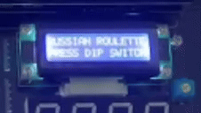

# iot_programing_team10
러시안룰렛&폭탄돌리기 (7-segment LED)
## 팀원
김남교 | 김보건 | 유진웅 | 한강빈
## 프로젝트 계획
- **폭탄 해체 게임**  dot matrix, 표현, 폭탄타이머 참고
- **인디언 포커 게임**  1:1 턴제를 참고

## 플로우차트

## **게임 소개**

 - ### **게임 시작시**
    

 - ### **타이머**
    
   * 타이머가 다 될 시 폭탄을 같고 있던 플레이어의 패배

  - ### **번갈아가며 총쏘기**
    
    * 폭탄에 번갈아 가며 총을 쏘고 폭탄과 총을 넘겨줌
    * 폭탄에 실탄을 쏜 플레이어의 패배

 - ### **타이머가 다 되거나 실탄을 쏘면 게임 종료**
    
    * clcd에 승리한 플레이어 표시

## **게임 코드**

 - **`'russian_roulette.c'` - 메인코드 작성**  
    앞의 모든 코드를 종합하여 메인 코드 제작 - 
    ['russian_roulette.c'](https://github.com/kimnamgyo/iot_programing_team10/blob/main/code/russian_roulette.c) 참고

---

## **게임 실행 영상**
- **러시안 룰렛 게임 실행 Youtube Link** : [H-Smart4412 활용 러시안 룰렛 게임(Russian Rulette Game)](https://youtu.be/yONbquB6PvU?feature=shared)

---

